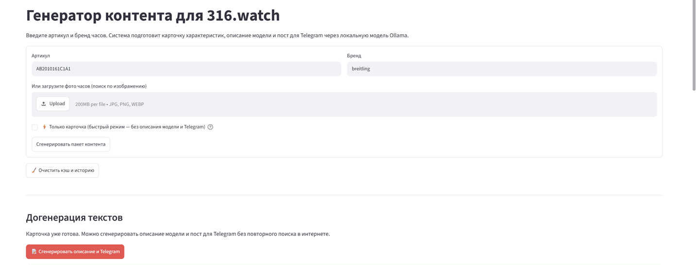

Финальный проект
# watchbase

Локальный генератор контента для интернет-магазина премиальных часов 316.watch. Инструмент по артикулу и бренду собирает технические характеристики из открытых источников, дополняет их справочником калибров и генерирует карточку товара, описание модели и пост для Telegram с помощью локальной модели Ollama.



## Возможности

- **Карточка товара** — автоматическое заполнение характеристик: механизм, калибр, камни, запас хода, частота, материалы, диаметр, водозащита, страна и др.
- **Справочник калибров** — если источник по модели не содержит specs, программа подставляет проверенные значения камней, частоты и запаса хода из локального справочника.
- **Описание модели** — художественный текст для карточки товара на сайте.
- **Telegram-пост** — готовый текст для публикации в канале.
- **Поиск по изображению** — можно загрузить фото часов, и система попытается найти модель через поиск.
- **Web-интерфейс** — удобная панель на Streamlit.

## Архитектура

```text
.
├── app/
│   ├── app.py                 # Streamlit-интерфейс
│   ├── generator.py           # Генерация карточки, описания и постов
│   ├── search.py              # Поиск официальных и авторитетных источников
│   ├── caliber_reference.py   # Справочник проверенных калибров
│   ├── brand_urls.py          # Правила поиска страниц по брендам
│   ├── retailers.py           # Классификация источников по tier
│   ├── image_search.py        # Поиск по изображению
│   ├── ollama_client.py       # Клиент для Ollama
│   └── utils.py               # Сохранение результатов в файлы
├── output/                    # Сгенерированные карточки и тексты
├── requirements.txt           # Python-зависимости
└── README.md
```

## Требования

- Python 3.10+
- Ollama с моделью `qwen2.5:14b`
- Playwright (для JS-рендеринга некоторых сайтов)

## Установка

1. Клонируйте репозиторий:

```bash
git clone https://github.com/USERNAME/watchbase.git
cd watchbase
```

2. Установите зависимости:

```bash
pip install -r requirements.txt
```

3. Установите браузер Playwright:

```bash
playwright install chromium
```

4. Убедитесь, что Ollama запущена и модель `qwen2.5:14b` доступна:

```bash
ollama pull qwen2.5:14b
```

## Запуск

```bash
streamlit run app/app.py
```

После запуска откройте в браузере: http://localhost:8501

## Как пользоваться

1. Введите артикул и бренд (например, `AB2010161C1A1` и `Breitling`).
2. При необходимости загрузите фото часов.
3. Нажмите **Сгенерировать пакет контента**.
4. Проверьте таблицу характеристик. Поля, подставленные из справочника калибров, будут помечены.
5. Если включён режим «Только карточка», позже можно догенерировать описание и Telegram-пост без повторного поиска.

## Особенности генерации

- Не выдумывает технические параметры: если данных в источниках нет, ставит «не найдено».
- Проверяет адекватность запаса хода (механические часы с запасом < 10 часов отбрасываются как ошибка).
- При подтверждённом калибре автоматически дополняет камни, частоту и запас хода из справочника.
- Очищает описание от маркетинговых клише и выдуманных технических фактов.

## Формат выходных данных

Результаты сохраняются в папку `output/YYYY-MM-DD/бренд-АРТИКУЛ/`:

- `result.json` — полный результат (карточка, описание, пост, источники).
- `card_import.csv` / `card_import.xlsx` — импорт на сайт.
- `social_posts.md` — посты для соцсетей.

## Автор

Контент-маркетолог 316.watch

## Лицензия

Без лицензии — внутренний проект 316.watch.
=======
